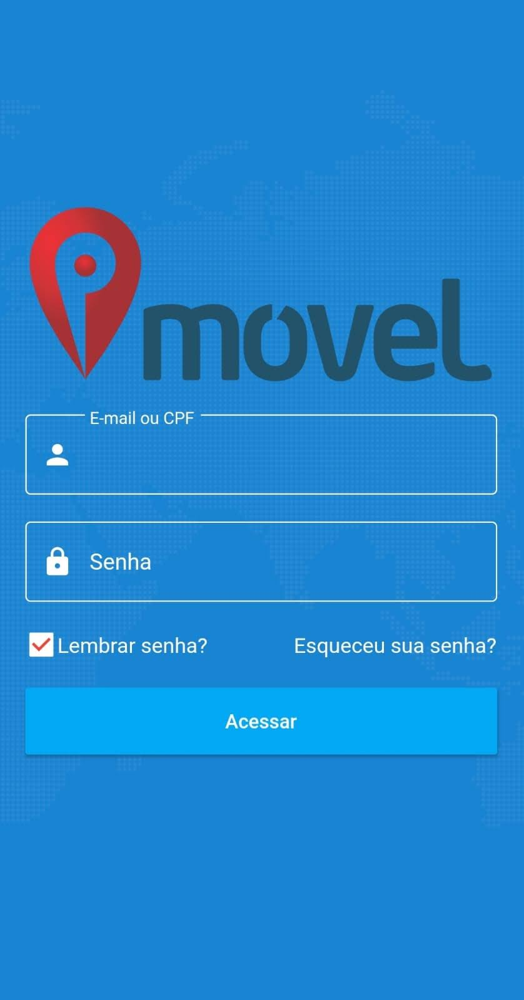
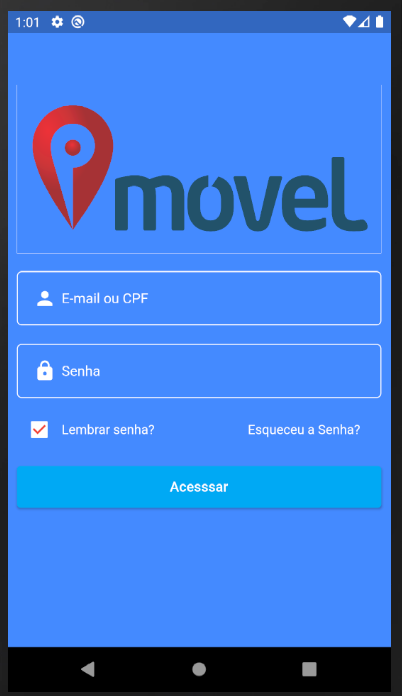

# login_pmovel_app

  
  
 

 
Tela Original do APP  /  Tela Recriada</>

## Descrição
* *Desenvolvido com [Flutter](https://flutter.dev/), o objetivo era recriar a tela de login baseada no app da [Pmovel](https://www.pmovel.com/)*

</img>
</img>

