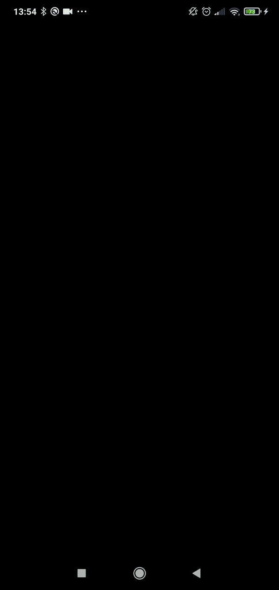

# Splash_Screen

  

## Descrição
* *Tela de splash desenvolvida com [Flutter](https://flutter.dev/) que simula um carregamento de uma aplicação, após o carregamento, ela transiciona para a tela principal do app.*
* *Para as animações das engrenagens e do "joinha" foi utilizado a ferramenta [Rive](https://rive.app/) que permite a edição da animação e disponibiliza um pacote
para o [Flutter](https://flutter.dev/) facilitando a implementação.*

</img>
</img>

### Package
- flutter
- rive: ^0.7.22

